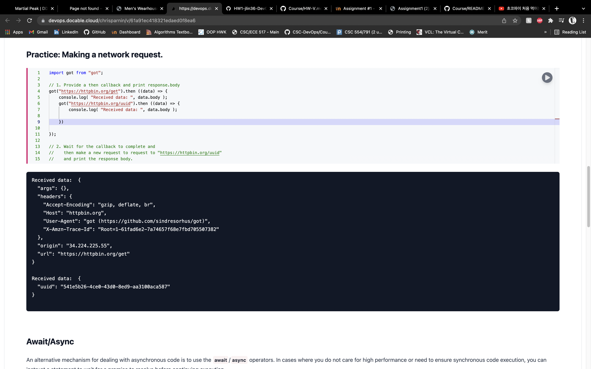
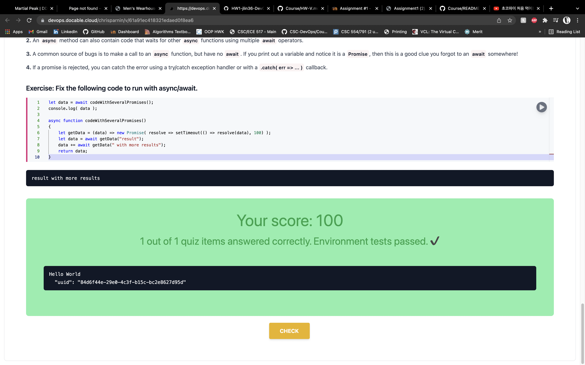

# V 

> A _minimal_ virtualization tool.

Example usage:

```bash
# M1
v up ubuntu-focal-m1/
# Windows/Virtual Box (Cmd.exe)
v up %USERPROFILE/.bakerx/.persist/images/focal
# Mac/Linux/Virtual Box
v up ~/.bakerx/.persist/images/focal

v ssh
```

Essential NodeJS: Promises - 



## Conceptual Questions

* Why can code be difficult to run on another machine? 
* Explain the concepts of a computing environment.
* Compare full emulation virtualization vs. binary translation
* What are some use cases associated with microvms and unikernels?
* In VM workshop, why can't the Virtual Box ip address be pinged from the host (or accessible from the web browser)?
* Compare bridged networking with host-only networking
* How does exactly does bakerx access the virtual machine through ssh?
* Explain the difference between the `rootfs` disk image and `initrd` disk image.
* What was a new feature, challenge, or interesting learning experience that you encountered while doing the homework or classroom exercises?
