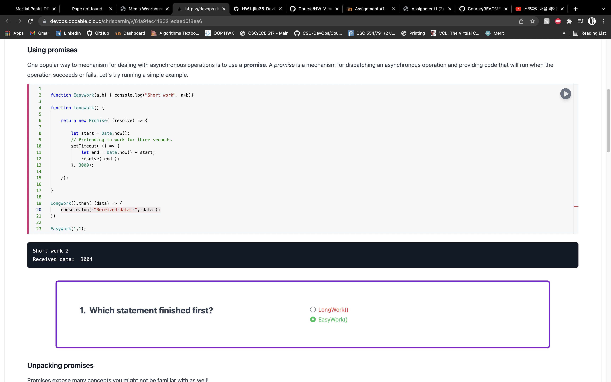

# V 

> A _minimal_ virtualization tool.

Example usage:

```bash
# M1
v up ubuntu-focal-m1/
# Windows/Virtual Box (Cmd.exe)
v up %USERPROFILE/.bakerx/.persist/images/focal
# Mac/Linux/Virtual Box
v up ~/.bakerx/.persist/images/focal

v ssh
```

Essential NodeJS: Promises - 
